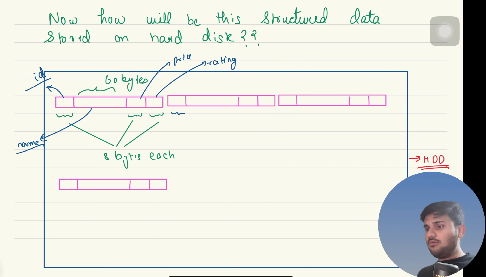

Requirements--
fast reads writes(more priority)
durability 
unstructured data
handle few petabytes of data

rdms-
we have schema predefined
sql is neither a language nor a database it is a standard it is the documentation it a standard to prepare a query language
type of data is predefined 

due to the fix schema the fixed datatype the db and suppose we have the db ordered by the id then the db correctly knows where is the next data in the hard disk

size of the data is not fixed and the size of the key can be different
and how will the update work in the above image when we update it with the key or the value of the different byte
 
the above is a very horrorific approach 
hard disk are optimized for sequential read and write

other approach is to whenever there is a we create a new updated key value and wrtie it to the hard disk 
insertion immediately and lazily remove
for reads we can do the linear search from the end 

we could use the lru cache for the data and the hashmap  just like the lru cache leetcode problem 
we store the address of the latest data where it is stored in the hard disk

we will store the data in the append only file 
these file are also called (wal) write ahead log
problems in this approach--
1. the file is ever-growing
2. if we have the billion keys than storing in the ram is not possible we are looking for the pb of data 
3. the ram lacks the durability we switch off the computer every thing is lost

New Approach 
LSM trees (log structured merge trees)
casandra ,dynamo ,bigtable,couch base

how the rdms uses the wal-->
1. when we index it uses the b+tree
2. when we write then the data is updated and also the b+ tree(log n)
so instead of rebalancing on every write it writes the new data in the wal and whenever the batch size is full it moves them from he wal to the b+ tree

 
how can we remove the duplicates from the wal this procedure is also knwo as compaction 
but to delete and occupy the space of the deleted then we need to shift the remaining data
ram hashmap will undergo a lot of changes  

why not mantain multiple wal files
we can store in the haskmap the key the wal and the offset   
  

what is happening with the put operation 
1. we are storing the data in the wal
2. we are storing the key,wal and the offset
3. if the current wal is full then we will create a new wal and store the data in the new wal

Reads are getting impacted
we can keep the latest wal file in the ram and the disk both(memtable refers to the hashmap prepared for the lastest wal)
so in the above approach we are doing the random access and this is momre expensive than the linear access .
if we do read from the memtable then the reads would be fast (memtable contains the keys and the values of the latest wal file)
so all in all we are doing whenever a new write is coming --> we are writing in the wal the offset in the ram and membtable which is also in the ram 
so what if we dont write the offset for the new wal as the latest data is stored in the memtable and the reads would be fast as this is in the ram  

in the memtable has the unique key copy and somehow we sort is also and the wal has duplicate also when the wal is full we save the memtable and discard the wal 
the new file will have the lesser data , the searching would be easy as we have sorted also
this file is also know as the sst (sorted set table)

but the two different files will still have duplicates

should we clear the memtable??

in the single sst we dont have duplicates but the two sst will have duplicates

Compaction -->
procedure to remove duplicates 
ss tables are small , so we can easily load 2-3 tables in ram
and do the merge sort and remove the duplicates
and create a new de duplicated log file
 and remove the older files
and now we can remove the offset(offset table was use to find the location of the particular entry )
inside the sst table we can do the binary search and we do not have store the offsets

how to optimize this logn
Sparse Index
we know search in a block in the hdd is fast even if there is the logn complexity
so we mantain a sparse index which contains the starting value fo each block 

ss tables are immutable they cannot be updated we can only create and search on it 
so how to support the deletion we use the sentinal value

we dont want to use the offset because the offset size would be same as the number of unique keys

TreeMap--
This is the sorted map implementation 
This is where the value is sorted on the basis of the keys 
this sorts the key either in the natural orderiging or the specified comparator (the time complexity of the put is the logN)
The inner implementation is the Red Black tree which is the self balancing binary search tree

